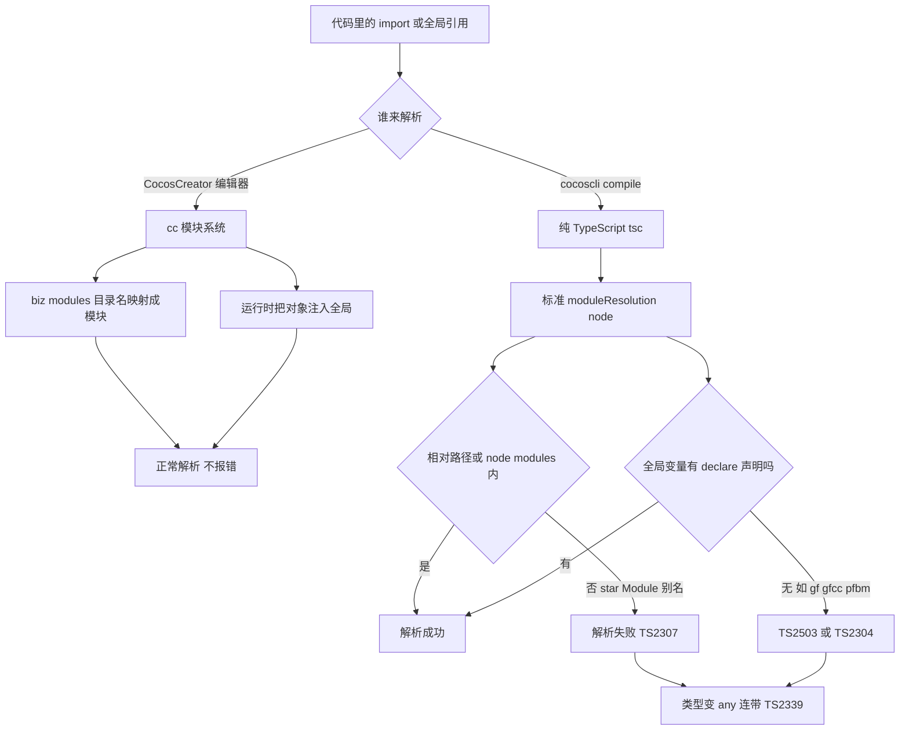

# cocoscli compile 与 Cocos 模块/全局变量的类型解析差异

> 状态：**已调查清楚**（2026-08-12）。*Module 别名已用 tsconfig paths 解决；gf 等运行时全局变量用 judgeNoise 降噪处理，属 Cocos 工程固有现象。

## 一、问题概要

`cocoscli compile` 用纯 TypeScript Compiler API 做类型检查，而 Cocos Creator 工程大量使用 Cocos 自有的模块系统（`assets/biz_modules/<目录名>` 与 `assets/node_modules/<目录名>` 即模块名）和运行时注入的全局变量（`gf` / `gfcc` / `lb` / `pfbm` 等）。这两类在 CocosCreator 编辑器里完全正常，但纯 tsc 解析不了，导致 compile 报大量 TS2307 / TS2503 / TS2339 / TS2304。

分两类，处理方式不同：

| 类别 | 典型代码 | 纯 tsc 报错 | 处理 |
|---|---|---|---|
| *Module 别名导入 | `import { IGamePropInfo } from "gamePlatformModule"` | TS2307 找不到模块 | **已解决**：tsconfig paths 映射 |
| 运行时全局变量 | `gf.sp.onSpineLoaded(...)` | TS2503 找不到命名空间 | judgeNoise 降噪（已折叠） |

## 二、根因：Cocos 模块系统 vs 纯 tsc

### CocosCreator 编辑器的模块系统

1. **biz_modules / node_modules 目录即模块**：`assets/biz_modules/gamePlatformModule/` 被注册为模块名 `gamePlatformModule`，`import x from "gamePlatformModule"` 能解析。
2. **运行时全局注入**：模块导出的对象被挂到全局（如 `gf = gameframe` 导出），代码里 `gf.sp.xxx` 无需 import 直接用。
3. 编辑器类型检查走这套 cc 模块系统，所以工程里**完全正常**。

### 纯 TypeScript（cocoscli compile）

1. **标准 `moduleResolution: node`**：bare import 按规则向上查 `node_modules`，`biz_modules` 不在查找路径 → `import from "gamePlatformModule"` 解析失败 → TS2307。
2. **全局变量需要 `declare` 声明**：`gf` 等运行时注入的全局，在 `.d.ts` 里没有 `declare namespace gf` / `declare const gf` → TS2503 / TS2304。
3. 解析失败后类型变 `any`，连带后续属性访问 `gf.sp.Spine` 触发 TS2339（属性不存在）。



## 三、问题一：*Module 别名导入（已解决）

### 现象

全工程 `*Module` 别名 import 上千处（loginModule 212、lobbyModule 180、protocolLogicModule 166、roomModule 160、gamePlatformModule 137……），纯 tsc 全部报 TS2307（找不到模块）。连带父接口类型丢失，`props[i].id` 误报 TS2339（`IGamePropInfoData extends IGamePropInfo`，父接口 `IGamePropInfo` 来自 `gamePlatformModule`，解析失败后 `id` 字段消失）。

### 模块实际位置（已查实）

- `assets/biz_modules/<name>/`：gamePlatformModule / lobbyModule / gameBaseModule / mahModule / agActivitySvrModule（各含 `index.ts` + `package.json(main:index.ts)`）
- `assets/node_modules/<name>/`：loginModule / protocolLogicModule / roomModule / miniGameModule / imModule / boxRoomModule……（commonlobbyframe submodule）

### 方案：tsconfig paths 映射

`ensureVerifyTsconfig` 生成的 `tsconfig.verify.json` 加 `baseUrl` + `paths`，把 `*Module` 还原到 biz_modules 与 node_modules 两路 fallback：

```json
"compilerOptions": {
  "baseUrl": ".",
  "paths": {
    "*Module": ["../assets/biz_modules/*Module", "../assets/node_modules/*Module"],
    "*Module/*": ["../assets/biz_modules/*Module/*", "../assets/node_modules/*Module/*"]
  }
}
```

### 验证（game-mahjong 工程）

| 指标 | 加 paths 前 | 加 paths 后 |
|---|---|---|
| TS2307（找不到模块） | 349 | **1** |
| `gamePropController.ts` 的 `props[i].id` | 误报 TS2339 | **不再报**（`IGamePropInfo.id` 正确解析） |

`real` 从 522 升到 632——这是**好事不是回退**：之前 `*Module` 解析失败时类型变 `any`（大面积假阴性，啥都不报），paths 让类型恢复后，strict 模式（`temp/tsconfig.cocos.json` 的 `strict:true`）把之前被掩盖的真实类型问题（TS2531 对象可能 null、TS2345 类型不匹配等）暴露出来。

提交：cocoscli `74cfb0d`。

## 四、问题二：gf 等运行时全局变量

### 现象

TS2503 `Cannot find namespace 'gf'`（225 条），编辑器不报。

### 调查链路

1. `dts/gameframe.d.ts` 顶层只有 `declare namespace gameframe`（3 处）和 `__inner_gf`（大量），**没有 `declare namespace gf`**。
2. `assets/node_modules/core/src/lib/gameframe.ts` 是**编译产物**（`let createGf = function(){ var gameframe = {}; ... }` + IIFE），末尾：
   ```ts
   let gf: typeof gameframe = createGf();
   export { gf };
   ```
   即 `gf` 是 **gameframe.ts 的模块导出**（类型 `typeof gameframe`），不是全局。
3. 但工程代码**全局用** `gf.sp.xxx`（无 `import { gf }`）。
4. Cocos 运行时把 `gf` 注入全局（编辑器认），纯 tsc 看到「模块导出被当全局用」→ TS2503。
5. `gameframe.d.ts` 里 `gameframe` namespace 含 `sp`（第 371 行 `namespace sp`、第 432 行 `onSpineLoaded`、第 433 行 `class Spine`）——即声明是齐全的，只是名字叫 `gameframe` 而非 `gf`，代码用了别名 `gf`。

### 处理：judgeNoise 降噪（现状）

TS2503 已被 `judgeNoise` 归 noise（`cocoscli/src/utils/verify.ts`）：

```ts
case 'TS2503': {  // Cannot find namespace 'gf'.
  return { noise: true, ns: ... };
}
```

225 条 `gf` TS2503 已折叠，**不在 real 里**。gf 后续属性（`gf.sp.Spine`）因 gf 变 `any` 而「假阴性」——不报错，但也不被类型检查。

### 可选方案：加 gf 全局声明（B1，未采用）

在工程 `dts/` 加 `gf-alias.d.ts`：

```ts
declare const gf: typeof gameframe;
```

（已确认 `gameframe.sp` 有 `onSpineLoaded` / `Spine`，类型可解析。）

- 收益：TS2503 gf 消失，gf 相关代码被类型检查
- 成本：工程特定（`gf=gameframe` 是本工程特有）；`dts/` 是 submodule 要单独提交；`gfcc` / `lb` / `pfbm` 等其他全局仍需逐个声明，无穷无尽

**未采用**，理由见第六节。

## 五、类比

- **Cocos 模块系统** = 公司内部黑话/代号：同事（编辑器）都懂，外面人（纯 tsc）听不懂。
- **纯 tsc** = 严格的外部审计员：只认成文的标准规则（相对路径、`node_modules`、`declare` 声明），不懂公司黑话。
- **`*Module` 别名** = 员工工号：cc 系统认，tsc 要给它一份花名册（tsconfig `paths`）才认 → **已补花名册**。
- **gf 等运行时全局变量** = 临时工：实际在岗（运行时注入），但没进花名册（无 `declare`），审计员当不存在 → TS2503；既然不是正式员工，索性在门口贴个名单说「这些人不用查」（judgeNoise 降噪）。

## 六、compile 的能力边界（结论）

**compile 能可靠检出的**（核心价值）：
- 单文件内的真实错误：语法错误（TS1005）、明显类型错误（TS2322/TS2345）、相对路径模块找不到（TS2307 相对路径）、未定义局部变量（TS2304 小写名）
- testerror 6 个脚本的错误全覆盖（验证通过）

**compile 检不准的**（Cocos 工程固有局限，需降噪兜底）：
- `*Module` 别名相关：已用 paths 解决（TS2307 349→1）
- 运行时全局变量（gf/gfcc/lb/pfbm）：无 `declare` 声明，judgeNoise 降噪 TS2503 / TS2304（大写名）。这类是 Cocos 运行时注入机制的根本差异，逐个生成声明通用性差、维护成本高，**接受降噪现状**

**为什么不为 gf 专门加声明**：gf 不是「漏 include 了某个声明文件」，而是 Cocos 运行时注入全局与纯 tsc 的根本差异。即使加了 `gf` 声明，`gfcc` / `lb` / `pfbm` 还会冒出来。这类全局变量交给 judgeNoise 通用降噪（TS2503 namespace + TS2304 大写名）是更合理的工程取舍。

## 七、延伸：pfbm 等小写全局变量的误报（可选后续）

`judgeNoise` 的 TS2304 规则是「首字母大写归 noise、小写归 real」（区分全局名与局部变量）。但 `pfbm` 这类**小写全局变量**也是运行时注入、无声明，按规则归了 real（误报）。

可选优化：给 TS2304 小写名加「频次法」——同名出现 >N 次（如 pfbm 全工程几百处）判为全局变量降噪，同时保留 testerror 的 `playerLevel`（1 处，真实未定义局部变量）归 real。属后续降噪规则增强，当前未做。

## 八、参考

- TypeScript moduleResolution（node 解析规则）：https://www.typescriptlang.org/docs/handbook/module-resolution.html
- TypeScript tsconfig paths（模块别名映射）：https://www.typescriptlang.org/tsconfig#paths
- TypeScript tsconfig skipLibCheck：https://www.typescriptlang.org/tsconfig#skipLibCheck
- TypeScript namespace 与全局声明：https://www.typescriptlang.org/docs/handbook/namespaces.html
- Cocos Creator 3.7 脚本与模块：https://docs.cocos.com/creator/3.7/manual/zh/scripting/modules/
- 关联文档：[cocoscli-compile语法错误阻断问题.md](./cocoscli-compile语法错误阻断问题.md)（Compiler API 收全量 diagnostics）
