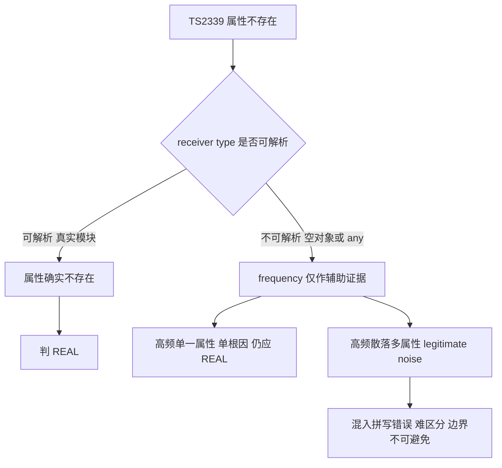

# cocoscli compile TS2339 频次降噪误判 audit

> 状态：AUDITED / FROZEN（2026-08-14）
> 关联：[compile P1-P3 可行性分析](./cocoscli-compile-模仿CocosCreator类型环境方案-可行性分析.md)

## 摘要（结论先行）

现有 `classifyDiagnostics` 的频次降噪规则「TS2339/TS2551 同 type count > 5 => noise」存在误判。全工程基线审计证明：

- **frequency 不能作为决定性证据**：62 条 freq>5 TS2339 noise 里，约 18%-26% 是被误杀的真实错误。
- **receiver type 可解析性是强证据**：`typeof import(真实模块)` 可解析时，property 确实不存在应判 REAL。
- **`{}` / any-like / error-recovery type 存在不可避免的分类边界**：残缺 noise 与真实拼写错误无法靠 freq 或 diagnostic message 区分。

P3.2 因此主动冻结：问题已量化、旧规则局限已证明，但尚无足够安全的新规则可直接替换。

## 基线数据

数据源 log：`compile-log-2026-08-14T02-47-03.json`
全工程 freq>5 TS2339 noise：**62 条 / 2 个 receiver type**

### Type #1 — `typeof import(".../proto_cm_protocol")`

| 字段 | 值 |
|---|---|
| Count | 10 |
| Properties | `{ game_scmj: 10 }`（单一 property 重复引用） |
| Files | GameTestActions.ts（10 处全在 1 文件） |
| receiver 可解析 | YES（proto_cm_protocol 模块存在） |
| 判定 | **REAL** |

单根因（game_scmj 缺失）影响多调用点。receiver type 可解析 + property 确实不存在 => 应 REAL，被 frequency heuristic 明确误杀。

### Type #2 — `{}`（空对象，TS 推不出真实形状）

| 字段 | 值 |
|---|---|
| Count | 52 |
| Properties | 18 个不同 property |
| Files | 20 个文件 |
| receiver 可解析 | NO（类型环境残缺） |

按性质分三类：

| 分类 | property（条数） | 性质 |
|---|---|---|
| 残缺 noise（合法字段访问空对象） | length×12, month×10, open×4, originalprice×3, jiazeng×3, openCreateRoom×3, indexOf×2, isUseFalseShare×2, mq×2, pic×2, maxCount×1, intervalRound×1, concat×1（约 45 条） | 业务字段访问被推断为 `{}` 的对象，根因是对象缺类型声明，非单点真错 |
| 真实错误（明确） | lenght×1（GameTestActionsView.ts:684，= length 拼写错误） | 真错，被残缺 noise 一起吞 |
| 不确定（单频可疑） | textLuck×1, actHY×1, topCreateMenu×1, cooldown×1, openGameIcon×1 | 单频，可能是真字段（残缺）或拼错，需人工看代码 |

## 误判率

```
全工程 freq>5 TS2339 noise:   62 条
  明确误杀（应 real）:         game_scmj 10 + lenght 1 = 11 条
  不确定:                      textLuck / actHY / topCreateMenu / ... 约 5 条
  legitimate-noise:            {} 残缺（合法字段访问空对象）约 46 条

误判率: 11/62 约 18%（明确） ~ 16/62 约 26%（含不确定）
```

## 实验条件

- 全工程 compile（临时移除 includePath，仅保留 excludePath=assets/biz_modules + runtimeGlobals pfbm/gf）
- audit 完成后配置已恢复（includePath 回到 assets/10000 + assets/scripts/testerror）
- 数据源 log：`compile-log-2026-08-14T02-47-03.json`
- P3.1 type identity 已修复（`typeof import("完整路径")` 不截断），因此本次 grouping 数据可信（修复前会被错误聚合成 `typeof import(`）

## 设计结论



1. **frequency 不能作为决定性证据**，只能作辅助证据。
2. **receiver type 可解析性是强证据**：可解析（typeof import 真实模块 / class / interface）+ property 不存在 => REAL；不可解析（`{}` / any-like / unresolved）=> frequency 才有资格作 noise 辅助。
3. **`{}` / any-like / error-recovery type 存在不可避免的分类边界**：合法字段访问残缺对象 vs 真实拼写错误，仅靠 diagnostic message 无法可靠区分。

## 为什么现在不实现 P3.2

Type #1 已有清晰解法：

```
receiver 可靠解析 + property 确实不存在 => REAL
```

但 Type #2 `{}` 暴露了真正难点：

```
{}.length      => 可能合法，只是类型缺失
{}.month       => 可能合法
{}.textLuck    => 不确定
{}.lenght      => 明确拼写错误
```

仅靠 TypeScript 当前 diagnostic 本身，很难可靠区分「合法但类型环境残缺」vs「真正拼写错误」。

如果现在强行设计规则，很容易从一个方向的错误（真实错误被误折 noise）翻成另一个方向（几十条类型环境噪音全部重新进 real），导致 AI 自动修复追着假错误跑。

> 现在最合理的结论：frequency 不能作为决定性证据；receiver type 可解析性是强证据；对于 `{}` / any-like / error-recovery type，当前仍存在不可避免的分类边界。这是有价值的设计结论，不需要马上「解决所有边界」。

类比理解：这就像医院的分诊台。频次（同一个症状出现很多次）只能说明「这一片可能有问题」，但不能判断单个病人是真病还是误报。真正能判断的是「检查仪器能不能看清」（receiver type 可解析性）——看得清的，没找到病灶就是真没问题（REAL 不存在）；看不清的（`{}` 模糊影像），就只能把整片标记为「待查」（noise），但这片里难免混进真病人（拼写错误）。

## P3.2 重新开启的条件（满足任一）

- 在第二个 / 第三个真实 Cocos 工程里收集到更多 freq>5 TS2339 样本；
- `{}` 类型样本数量明显影响 AI 自动修复效果；
- 找到额外强证据（例如从 AST / TypeChecker 判断原始对象声明来源，而非只看 diagnostic message）；
- 能提出新规则，并在当前 62 条基线上证明：**减少 game_scmj / lenght 这类假阴性，同时不把约 46 条 legitimate noise 大量拉回 real**。

否则现在为了一条 lenght 去设计复杂 heuristic，容易过拟合 game-mahjong。

## compile 主线状态

```
P1    Project Type Environment          完成
P2    moduleExport Runtime Global       完成
P3    namespaceAlias Runtime Global     完成
P3.1  Diagnostic Type Identity          完成
P3.2  TS2339 Frequency Heuristic        AUDITED / FROZEN
```

P3.2 不是「没做完」，而是：**问题已量化、旧规则局限已证明、新规则证据暂时不足，因此主动冻结。** 这是比继续堆 heuristic 更稳的工程决策。

## 引用

- [compile P1-P3 可行性分析](./cocoscli-compile-模仿CocosCreator类型环境方案-可行性分析.md)
- [compile 全局变量报错分析](./cocoscli-compile-全局变量报错分析.md)
- classifyDiagnostics 实现：`src/utils/verify.ts`（typeOf / freq 阈值，P3.1 已修 type identity）
- P3.1 提交：`5e9ab7a fix(compile): preserve quoted import types in diagnostic grouping`
- compile 收尾提交：`244b181 fix(compile): clean stale strict messaging and log runtime global bridges`
