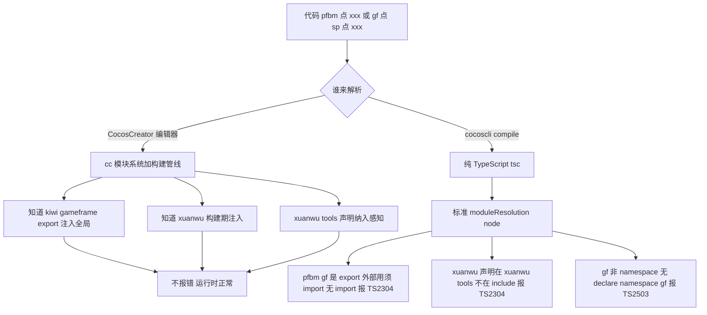

# cocoscli compile 全局变量报错分析

> 状态：**已调查清楚**（2026-08-13）。pfbm/xuanwu/gf 等全局变量，CocosCreator 编辑器不报错，纯 tsc compile 报 TS2304/TS2503。本文用真实代码分析机制差异。

## 一、问题现象

`cocoscli compile`（默认 `strict:false`）跑 game-mahjong 工程，real 里有大量"找不到名字/命名空间"错误，但 CocosCreator 编辑器里这些代码没有红色报错，运行时也完全正常。

典型三类（全工程默认模式下 ~120+ 条）：

| 全局变量 | 报错 code | 默认归类 | 条数（实测） |
|---|---|---|---|
| `pfbm` | TS2304 Cannot find name | real（小写名） | ~60 |
| `xuanwu` | TS2304 Cannot find name | real（小写名） | ~58 |
| `gf` | TS2503 Cannot find namespace | noise（namespace 规则） | ~167 |

## 二、三类全局变量的真实代码

### 2.1 pfbm —— 模块导出当全局用

**报错代码**（`assets/10000/controller/cmd/gameCmd/GameDrawnCmd.ts:82`）：
```ts
pfbm.uiFgui(FuiBoxScmjViewDefine.BoxScmjTingPaiView).hideFgui();
```
compile 报：`TS2304 Cannot find name 'pfbm'.`

**pfbm 的真实定义**（`assets/node_modules/kiwi/src/core/PrefabManger.ts:2190`）：
```ts
export const pfbm: PrefabManger = gt.pfbm;
```
即 `pfbm` 是 **kiwi 模块的 export**（PrefabManger 实例）。但全工程 60+ 处用它时**没有 `import { pfbm } from "kiwi"`**，直接当全局变量 `pfbm.xxx()`。

### 2.2 xuanwu —— 声明文件没被 include

**报错代码**（`assets/biz_modules/agActivitySvrModule/configCls/ConfigCls.ts:3`）：
```ts
export interface IactivityCls extends xuanwu.IactivityConfig {}
```
compile 报：`TS2304 Cannot find name 'xuanwu'.`

**xuanwu 的真实声明**（`xuanwu_tools/build-xuanwusdk/contract/AdapterInterface.d.ts:35`）：
```ts
declare namespace xuanwu.adapter {
  ...
}
```
xuanwu **有声明**，但声明文件在 `xuanwu_tools/`（工程根目录下），而 tsconfig.verify.json 的 include 是 `assets/**/*.ts` —— **xuanwu_tools 不在 include 范围**，所以 tsc 看不到 `declare namespace xuanwu`，全局用 `xuanwu.XXX` 报 TS2304。

### 2.3 gf —— namespace 用了别名

**报错代码**（`assets/10000/config/FguiViewDefine.ts:301`）：
```ts
gf.sp.onSpineLoaded(KW_Ani, (sp: gf.sp.Spine) => {
  ...
});
```
compile 报：`TS2503 Cannot find namespace 'gf'.`（gf 当 namespace 用）

**gf 的真实定义**：
- `assets/node_modules/core/src/lib/gameframe.ts` 末尾：
  ```ts
  let gf: typeof gameframe = createGf();
  export { gf };
  ```
  即 `gf` 是 gameframe.ts 的 **模块 export**（类型 `typeof gameframe`）。
- `dts/gameframe.d.ts` 顶层声明的是 `declare namespace gameframe`（含 sp/onSpineLoaded/Spine），**没有 `declare namespace gf`**。

代码全局用 `gf.sp.XXX`（namespace 语法），但类型层面 `gf` 是模块 export、`gameframe` 才是有 namespace 声明的名字 —— `gf` 这个 namespace 在类型系统里不存在 → TS2503。

## 三、运行时来源（为什么运行时这些全局能用）

Cocos Creator 的运行时（cc 模块系统）会把"模块导出"挂到全局作用域，让业务代码无需 import 直接用：

| 全局 | 运行时来源 | 注入方式 |
|---|---|---|
| `pfbm` | kiwi 模块 `export const pfbm` | Cocos 模块系统加载 kiwi 时，把 export 挂全局（或 window） |
| `gf` | gameframe 模块 `export { gf }` | 同上，gameframe 加载后 gf 全局可用 |
| `xuanwu` | xuanwu_tools 生成的运行时对象 | 构建期注入（xuanwu_tools 是 SDK 构建工具） |

所以**运行时 pfbm/gf/xuanwu 都是真实存在的全局对象**，代码 `pfbm.xxx()` / `gf.sp.xxx()` 运行正常。

## 四、为什么 CocosCreator 编辑器不报错

CocosCreator 编辑器的 TypeScript 语言服务有自己的处理：

1. **cc 模块系统感知**：编辑器知道哪些模块的 export 会被注入全局（pfbm/gf 来自 kiwi/gameframe），所以全局引用不报"找不到"。
2. **构建期全局识别**：xuanwu 这类由构建工具（xuanwu_tools）注入的全局，编辑器/构建管线在类型检查时把它们当已知全局。
3. **宽松的类型解析**：编辑器对 cc 工程的"全局变量惯例"宽容，不像纯 tsc 那样严格按 ES module 规则（有 export 就是模块，外部用必须 import）。

## 五、为什么纯 tsc（cocoscli compile）报错

`cocoscli compile` 用编辑器内置的 TypeScript Compiler API（`ts.createProgram`），但 tsconfig 是**标准 ES module 配置**（`moduleResolution: node` + `isolatedModules`），严格按规则解析：

1. **pfbm / gf**：定义文件有 `export`（`export const pfbm`、`export { gf }`）→ 该文件是**模块**→ 内部符号是模块作用域，外部用必须 `import`。代码没 import 直接用 → TS2304。
2. **xuanwu**：声明文件 `declare namespace xuanwu` 在 `xuanwu_tools/`，**不在 include**（`assets/**/*.ts`）→ tsc 根本没读到这个声明 → 全局用 → TS2304。
3. **gf 当 namespace**：类型系统里 `gf` 是变量（模块 export），不是 namespace；`declare namespace gf` 不存在 → `gf.sp.XXX` 的 namespace 用法 → TS2503。

纯 tsc 没有 cc 模块系统的"运行时全局注入"感知，只认标准模块规则 + include 范围内的声明。

## 六、机制对比



| 维度 | CocosCreator 编辑器 | cocoscli compile（纯 tsc）|
|---|---|---|
| 模块系统 | cc 模块系统 + 构建管线 | 标准 ES module |
| 全局变量注入感知 | 有（运行时注入已知）| 无（只认 declare/import）|
| 声明文件范围 | 含 xuanwu_tools 等 | 仅 tsconfig include（assets/**）|
| pfbm/gf（export 当全局）| 不报（知道注入）| TS2304（export 须 import）|
| xuanwu（声明未 include）| 不报（构建管线感知）| TS2304（include 不到）|
| gf namespace 用法 | 不报（gf=gameframe 别名已知）| TS2503（无 declare namespace gf）|

## 七、解决方案（按治本程度）

### 方案 A：tsconfig paths 还原模块别名（已用于 *Module，但对 pfbm/gf 不适用）

`*Module` 用 paths 映射解决（`gamePlatformModule` → biz_modules 目录）。但 pfbm/gf 是**模块导出的全局别名**（不是 bare module import），paths 解决不了"模块 export 当全局用"。xuanwu 可用 include 补声明（见方案 B）。

### 方案 B：补 include / 加全局声明（治本，但工程特定）

- **xuanwu**：tsconfig.verify.json 的 include 加 `../xuanwu_tools/build-xuanwusdk/contract/**/*.d.ts`，让 tsc 读到 `declare namespace xuanwu`。但 xuanwu_tools 是 SDK 工具目录，是否该纳入类型检查需评估。
- **gf**：加一个全局 `gf-alias.d.ts`：`declare const gf: typeof gameframe;`（gameframe.d.ts 已声明 gameframe namespace，gf 是其别名）。但 gf 是工程特定的别名关系。
- **pfbm**：加 `declare const pfbm: typeof import("kiwi").pfbm;` 或类似全局声明。

成本：每个全局变量都要单独加声明，且不同工程的全局不同，通用性差。

### 方案 C：suspectedGlobal 多维降噪（推荐，通用）

不治本（不补声明），但把这类"运行时全局变量"的报错从 real 移到单独的 Suspected 分类：

- 多维证据：高频引用 + 跨多文件 + 无声明（TS2304/TS2503 本身）+ 短名/已知白名单（gf/gfcc/lb/pfbm/xuanwu/cc）
- 满足 → 归 Suspected Runtime Globals（单独列出 references/files，不进 real、不喂自动修复）
- 不满足（如 testerror 的 playerLevel，1 处 1 文件）→ 留 real

这样 real 干净（真实错误），Suspected 让人扫一眼即可。详见《cocoscli-compile-错误分类架构设计》。

### 方案 D：接受现状（当前）

`judgeNoise` 已通用降噪 TS2503（gf namespace，归 noise）+ TS2304 大写名。pfbm/xuanwu（小写）目前归 real，是 real 的主要"误报"成分。若能接受 real 含这些，无需额外处理。

## 八、类比

- **CocosCreator 编辑器** = 本地老员工：知道公司有哪些"约定俗成的全局代号"（pfbm/gf/xuanwu），听到就懂，不查字典。
- **纯 tsc compile** = 新来的严格审计员：只认"花名册"（declare/import/include 范围），花名册上没有的名字一律报"查无此人"。
- 差距不在"代码对不对"（运行时都对），而在"审计员手里有没有那份非正式的全局代号清单"。
- 方案 C（suspectedGlobal）= 给审计员一份"疑似公司代号"名单，让他把这些人单列出来（不直接放行也不当错误），问老员工确认。

## 九、结论

pfbm/xuanwu/gf 报错不是代码错误，是**纯 tsc 与 Cocos 运行时全局注入机制的认知差异**：

- 运行时：pfbm/gf 是模块 export 被注入全局；xuanwu 是构建工具注入；编辑器/构建管线都感知 → 不报。
- 纯 tsc：只认标准模块规则 + include 范围声明 → pfbm/gf 当全局用违反模块规则（TS2304），xuanwu 声明不在 include（TS2304），gf namespace 用法无对应 declare（TS2503）。

最务实的工程取舍是**方案 C（suspectedGlobal 多维降噪）**：通用、不破坏运行时、保留真实错误检测能力，把这类全局变量误报单独归类供复核。

## 十、参考

- 关联：[cocoscli-compile-Cocos模块与全局变量类型解析问题](./cocoscli-compile-Cocos模块与全局变量类型解析问题.md)（*Module + gf 深入调查）
- 关联：[cocoscli-compile-错误分类架构设计](./cocoscli-compile-错误分类架构设计.md)（suspectedGlobal 多维判定）
- TypeScript 模块与全局：https://www.typescriptlang.org/docs/handbook/modules.html
- TypeScript namespaces：https://www.typescriptlang.org/docs/handbook/namespaces.html
- Cocos Creator 脚本模块：https://docs.cocos.com/creator/3.7/manual/zh/scripting/modules/
