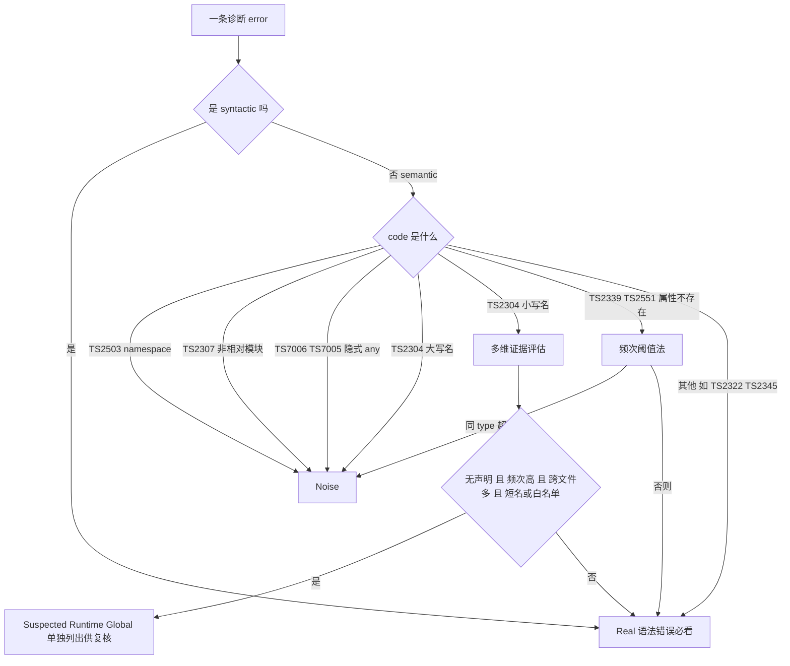

# cocoscli compile 错误分类架构设计（v2：多维证据 + suspectedRuntimeGlobal）

> 状态：**设计稿**（2026-08-12），待 review。基于《cocoscli-compile-Cocos模块与全局变量类型解析问题》的能力边界结论，针对 `judgeNoise` 当前"频次法"的误杀风险重新设计。

## 一、设计目标

1. 尽可能发现真实错误（compile 的核心价值）
2. 避免 Cocos 特有机制（运行时全局变量 gf/gfcc/lb/pfbm）制造垃圾错误
3. **不简单吞掉高频项**——高频只是"疑似全局变量"的证据，不应直接等于 noise

## 二、当前方案的问题（为什么要改）

`judgeNoise` 现在对 TS2304 的规则是「大写名归 noise、小写名归 real」。延伸思路里提过给 TS2304 小写名加"频次法"（同 name > N 次归 noise）。

**风险**：单纯频次会把"真实拼写错误被复制粘贴到几十个文件"误判成合法全局变量，把真实错误藏起来。这违背目标 1。

**修正原则**：高频只是证据之一。要判定"疑似运行时全局变量"，需要多维证据共同支持，且判定结果不直接进 noise，而是单独成一类供人复核。

## 三、三分类架构

把诊断从原来的 `real / noise` 二分类，改成 `real / suspectedGlobals / noise` 三分类：

| 分类 | 含义 | 是否喂 opencode 修复 | 是否进 log |
|---|---|---|---|
| **Real** | 确定的真实错误（语法、相对路径模块、真实类型/拼写错误） | 是 | 全量 |
| **Suspected Cocos Runtime Globals** | 多维证据指向运行时全局变量，**但不直接信任**，单独列出供人复核 | 否（避免修全局变量引入新问题） | 全量 + 统计 |
| **Noise** | 确定的环境噪音（TS2503 namespace、TS2304 大写名、TS2307 非相对、隐式 any 等） | 否 | 摘要折叠 |

**关键区别**：Suspected Globals 不进 Noise。Noise 是"确定不需要看"，Suspected 是"机器怀疑但请人扫一眼"。这样用户一眼能看到 pfbm/gfcc 被判疑似全局、各自多少引用/多少文件，异常项（如某个真实拼写错误被误判）容易在复核时发现。

## 四、多维证据维度

针对 TS2304 小写名候选（如 `pfbm`、`playerLevel`），采集四维证据：

| 维度 | 含义 | 来源 | 阈值（建议） |
|---|---|---|---|
| 频次 | 同 name 出现次数 | 诊断数组按 name 聚合 | ≥ 20 |
| 跨文件 | 出现在多少个不同 file | 同上，file 去重 | ≥ 5 |
| 无声明 | tsc 已报 TS2304 Cannot find name | 诊断 code 本身 | 必要条件 |
| Cocos 全局特征 | 小写短名 / 已知白名单 | name 形态 | 短名（≤8）或命中白名单（gf/gfcc/lb/pfbm/cc/jsb/fgui…） |

**判定**：`无声明 且 频次≥20 且 跨文件≥5 且 (短名 或 白名单)` → Suspected Global；否则 → Real。



## 五、输出格式

```text
Real Errors: 12
  assets/scripts/testerror/03-undefined-variable.ts(9,13): TS2304 Cannot find name 'playerLevel'.
  ...

Suspected Cocos Runtime Globals: 4   （不进 Real，请人工扫一眼，详见 log）
  pfbm     386 references / 72 files
  gfcc     214 references / 41 files
  lb       128 references / 33 files
  xxx       96 references / 20 files

Noise: 532 (folded, 详见 log)
```

Real 数稳定到"真实可修的错误"；Suspected 给出引用规模让用户判断是否真是全局变量；Noise 折叠。

## 六、代码落地（cocoscli `src/utils/verify.ts`）

### 新增类型

```ts
interface SuspectedGlobal {
  name: string;
  code: string;                  // TS2304
  count: number;                 // 引用次数
  files: string[];               // 出现在哪些文件（去重）
  diagnostics: ScriptDiagnostic[]; // 原始诊断（追溯用）
}

interface ClassifiedDiagnostics {
  real: ScriptDiagnostic[];
  suspectedGlobals: SuspectedGlobal[];   // 新增
  noise: ScriptDiagnostic[];
  noiseSummary: NoiseSummary;
  syntacticCount: number;
  semanticCount: number;
}
```

### classifyDiagnostics 改造要点

```ts
// 多维阈值（可调）
const GLOBAL_FREQ_MIN = 20;
const GLOBAL_FILES_MIN = 5;
const GLOBAL_NAME_MAX_LEN = 8;
const KNOWN_COCOS_GLOBALS = new Set(['gf', 'gfcc', 'lb', 'pfbm', 'cc', 'jsb', 'fgui']);

function classifyDiagnostics(errors: ScriptDiagnostic[]): ClassifiedDiagnostics {
  // 1. 层1 judgeNoise（TS2503/TS2307非相对/TS7006/TS7005/TS2304大写）→ noise（保持）
  // 2. syntactic 全部 → real（保持）
  // 3. TS2339/TS2551 频次阈值法 → noise（保持）
  // 4. TS2304 小写名：收集，按 name 聚合 { count, files:Set }
  //    - 满足多维(无声明且频次且跨文件且短名/白名单) → suspectedGlobals
  //    - 否则 → real（保留，可能是真实拼写错误如 playerLevel）
  // 5. 其余 semantic → real
}
```

### 命令层展示（compile.ts / verify.ts command）

- Real：逐条展示（保持）
- Suspected Globals：新增一段，列出 name + references + files（不喂 opencode）
- Noise：摘要折叠（保持）
- log JSON：errors(real) / suspectedGlobals / noise 三段全量

## 七、技术难点与诚实标注

### 难点 1：「无声明」的精确判断

cocoscli 侧只有诊断 JSON，"无声明"只能用「TS2304 Cannot find name 本身」近似（tsc 已经找不到）。要精确区分「真无声明」vs「声明在 tsc 没解析到的地方」，需要 cocos-mcp 侧用 TypeChecker 配合（如 `checker.tryGetSymbolInScope` / 全局符号表）。

**但**：paths 修复后 `*Module` 解析已恢复，剩余的 TS2304 小写名基本就是「真无声明」（运行时全局 或 真实拼写错误），*Module 连锁导致的假 TS2304 已消失。所以 cocoscli 侧的近似在 paths 修复后是可靠的。

### 难点 2：复制粘贴拼写错误的残余风险

多维证据能大幅降低误判（真实局部变量不该跨几十个文件且无声明），但极端情况——**同一种拼写错误被复制到几十个文件**——仍可能被判 Suspected Global。

**缓解**：Suspected Global 单独成类、不直接吞、带 references/files。复核时异常项容易被发现（如某 name 引用集中在某个子系统而非全工程散布，或 name 本身像拼写错误不像全局变量）。这是"机器怀疑 + 人扫一眼"的设计意图，而非追求零误判。

### 难点 3：阈值调参

频次 20 / 跨文件 5 / 短名 8 是经验初值，需要跑 game-mahjong 实测调整：
- 太松：真实错误被误判 Suspected
- 太严：pfbm 等仍进 Real（回到现状）

建议首次实现后，用 testerror（playerLevel 单文件 1 处，应留 Real）和 pfbm（全工程几百处，应进 Suspected）作为回归用例校准。

## 八、可选增强（cocos-mcp 侧，Phase 2）

如果 cocoscli 侧的近似不够，可在 cocos-mcp `diagnostics.ts` 用 TypeChecker 增强：
- 对每个 TS2304 候选 name，查 `program.getTypeChecker()` 的全局符号，确认工程内 + 引用的 .d.ts 内确实无声明
- 把"是否无声明"作为精确信号传给 cocoscli

这能消除难点 1 的近似，但增加 cocos-mcp 复杂度，建议先做 cocoscli 侧多维方案，看实测精度再决定是否上 Phase 2。

## 九、与当前实现的关系（迁移路径）

1. **保留**：judgeNoise 层1规则、syntactic 全 real、TS2339/TS2551 频次阈值法
2. **新增**：suspectedGlobals 通道 + TS2304 小写名多维判定
3. **改变**：TS2304 小写名从「一律 real」改为「多维判定，满足进 suspected，否则仍 real」
4. 输出从二分类（real/noise）变三分类（real/suspected/noise）

向后兼容：suspectedGlobals 可视为 real 的子集（都是"非 noise"），上层命令可选择把 suspected 也算进"需关注"，或单独展示。log 全量保留，不丢信息。

## 十、类比

- **频次法** = 保安看到一个人天天进大楼就当员工放行：问题是混进来的惯犯也被当员工。
- **多维证据 + Suspected** = 保安不仅看频次，还看「有没有工牌（声明）」「是不是从多个门进（跨文件）」「像不像常驻（短名/白名单）」，满足才发一张「疑似员工」临时牌贴在公告栏（单独列出），大家扫一眼有没有认错的，而不是直接放进办公室（noise）。

## 十一、参考

- 关联文档：[cocoscli-compile-Cocos模块与全局变量类型解析问题](./cocoscli-compile-Cocos模块与全局变量类型解析问题.md)（能力边界与 gf 调查）
- 关联文档：[cocoscli-compile语法错误阻断问题](./cocoscli-compile语法错误阻断问题.md)（Compiler API 收全量 diagnostics）
- TypeScript Compiler API TypeChecker：https://github.com/microsoft/TypeScript/wiki/Using-the-Compiler-API
