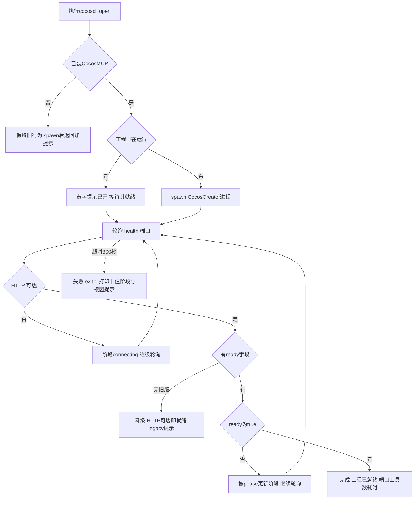

# cocoscli open 等待工程真正就绪方案

> 日期：2026-08-20
> 状态：已实施（CocosMCP 1.5.5 + cocoscli open/init/verify 改造）

## 一、问题背景

`cocoscli open` 原实现是 fire-and-forget：spawn CocosCreator 进程后立即打印「已打开」返回成功。但此刻工程实际还在 Loading Resources：

```
spawn(CocosCreator.exe)
    |
进程启动成功
    |
open 成功   <-- 太早：工程还在加载资源，MCP 工具未注册，场景未就绪
```

后果：`cocoscli open` 之后紧接着 `cocoscli compile`，CocosMCP 的 `run_script_diagnostics` 可能还没注册，调用失败。用户被迫用外挂 `wait_mcp_ready.py` 打补丁——它轮询 `/health` 能访问后再固定 sleep 15 秒猜工具注册完成，本质是给「open 过早返回」打的补丁。

## 二、目标语义

```
cocoscli open exit 0 = 这个 Cocos 工程现在可以被后续 CLI / MCP 操作
```

就绪判定链：

```
扩展加载 load
    |
MCP HTTP server 启动 listen
    |
工具注册 setupTools
    |
场景就绪 scene:ready
    |
/health 返回 ready:true
    |
cocoscli open 返回成功
```

## 三、类比理解

把打开 Cocos 工程类比成餐厅开业：

- **旧 open**：店门推开一条缝（进程起来）就挂「营业中」牌子——客人进店发现桌子还没摆好（资源没加载完）、后厨没开火（MCP 工具没注册）、包间还锁着（场景没就绪）。
- **新 open**：门口挂「准备中」，等灯亮了、后厨点火、包间开门（四项检查全过）才翻「营业中」牌子。客人（compile/eval 等命令）看到牌子就能直接点单。
- **旧版兼容**：有的老店（旧版 CocosMCP）门口只装了一个「店里有人吗」的灯（HTTP 状态码），没有「准备完毕」的灯（ready 字段）——这种店只能看「有人灯」亮就放客人进去，并提醒店主换个新灯箱。

## 四、整体流程



## 五、CocosMCP 侧改动（1.5.5）

### 5.1 四项就绪状态机（source/mcp-server.ts）

```typescript
export interface McpReadyState {
    extensionLoaded: boolean;   // 扩展 load() 已执行（构造即置位）
    serverStarted: boolean;     // HTTP server listen 成功
    toolsRegistered: boolean;   // setupTools 完成
    sceneReady: boolean;        // scene:ready 已触发（main.ts 推送）
}
```

状态存 MCPServer（/health handler 同步可读），sceneReady 闩锁存 main.ts（scene:ready 广播只有 main.ts 能收到），经 `updateReadyState(patch)` 推送。

关键置位点：
- `constructor` 末尾：`extensionLoaded = true`
- `start()` 里 `setupTools()` 后：`serverStarted = toolsRegistered = true`
- `stop()`：复位 serverStarted / toolsRegistered（sceneReady 是扩展级事实不动）
- `onSceneReady`（main.ts）：置闩锁 + 推送（切场景重复触发只记第一次）
- `updateSettings` 重建 MCPServer 后：补推闩锁（否则 /health 永远卡 sceneLoading）
- `unload`：全部复位

### 5.2 /health 响应升级（向后兼容）

```json
{
  "status": "ok",
  "tools": 46,
  "version": "1.5.5",
  "ready": true,
  "phase": "ready",
  "detail": {
    "extensionLoaded": true,
    "serverStarted": true,
    "toolsRegistered": true,
    "sceneReady": true
  }
}
```

`status`/`tools` 原样保留（旧版 cocoscli 只看状态码不受影响）；`phase` 为首个未完成阶段（extensionLoading / serverStarting / toolsRegistering / sceneLoading / ready）。**旧版判定基准：响应体无 `ready` 字段 = 旧版。**

## 六、cocoscli 侧改动

### 6.1 新增工具函数（src/utils/verify.ts）

| 函数 | 说明 |
|---|---|
| `httpGetJson(url, timeoutMs)` | GET 并解析 JSON（非 2xx / 坏 JSON / 网络错误返回 null） |
| `fetchMcpHealth(port)` | 单次探测：`{reachable, health}`（reachable 判据与旧 httpOk 一致） |
| `waitForMcpReady(port, options)` | 轮询直到 ready:true；`{ok, legacy, phase, elapsedMs, health}` |
| `describeMcpPhase(phase)` | 阶段中文描述（open/verify 共用） |

轮询语义（默认 300s 超时 / 3s 间隔，首 tick 立即探测）：
- HTTP 不可达 → `connecting`，继续等
- `ready === true` → ok
- `ready` 字段缺失（旧版/坏 JSON）→ **降级**：立即 ok、`legacy:true`（不劣于旧判据）
- `ready === false` → 继续等，phase 映射服务端阶段
- 超时 → `ok:false` + 卡住阶段

`onProgress` 仅阶段变化时回调，防刷屏。

### 6.2 open 命令（src/commands/open.ts）

- 未装 CocosMCP：保持旧行为（spawn + 绿字 + 黄字提示），open 对普通工程不能挂 300 秒
- 已装 + 已在运行：黄字提示后**进入等待**（open 语义 = 工程现在可操作）
- 已装 + 未运行：spawn → 等待
- 成功：`[完成] 工程已就绪：dir（MCP 端口 3001，工具 46 个，CocosMCP 1.5.5，耗时 42 秒）`
- legacy：黄字提示升级路径
- 超时：红字 `[失败]` + 卡住阶段 + 按 phase 根因提示（connecting：扩展没装/node_modules 缺失/端口被占；sceneLoading：手动开场景后重跑 open 续等）+ 代理旁证 + exit 1

### 6.3 init / verify / compile

- `init` 第七步复用 `openAndWaitReady`（等待超时发生在第八步登记前，重跑 init 走 exists 分支快速续装）
- `verify` 第1步的 18×5s 手写轮询替换为 `waitForMcpReady(90s)`（超时仍软失败继续跑）
- `compile` 检查 3 提示语更新（指向新 open 语义）

## 七、输出示例

正常路径：

```
已拉起 CocosCreator 进程（免登录）：E:\WorkProjects\mygame
等待工程就绪（轮询 http://127.0.0.1:3001/health，最多 300 秒）...
  CocosMCP 扩展已加载，等待 server 启动（端口 3001）...
  工具已注册，等待场景就绪（scene:ready）...
[完成] 工程已就绪：E:\WorkProjects\mygame（MCP 端口 3001，工具 46 个，CocosMCP 1.5.5，耗时 42 秒）
```

超时失败：

```
[失败] 等待工程就绪超时（300 秒），卡在阶段：等待场景就绪（scene:ready，资源导入中）
  [提示] 编辑器可能仍在导入资源，或工程未自动恢复任何场景。
  在编辑器手动打开任一场景（会触发 scene:ready）后重跑 cocoscli open（已开状态会继续等待就绪）。
```

## 八、已确认的设计决策

| 决策点 | 选择 | 理由 |
|---|---|---|
| 超时行为 | exit 1（默认 300 秒） | 严格语义适合 CI/Agent 链路；大工程首次含资源导入 120s 不够 |
| 旧版兼容 | 降级 + 黄字提示 | 旧工程第一次跑新 open 不失败，行为不劣于旧判据 |
| init 第七步 | 也等待 | init 与 open 语义一致，init 完直接 compile 不失败 |
| submodule | push 到 fork | 其他机器 submodule update 能拉到 |
| scene:ready 严格性 | 必需（不放宽） | CocosMCP 主工具都依赖场景进程；超时提示引导手动开场景续等闭环 |
| --timeout 参数 | 暂不加 | 常量集中一处，后续要加是一行事 |

## 九、风险与边界

1. **全新工程无场景**：从未保存过场景的工程不自动恢复场景 → open 超时 exit 1；在编辑器手动建/开场景后重跑 open 续等成功
2. **alreadyRunning 语义收紧**：工程开着但 MCP 挂了（端口被抢）时，open 从「成功」变「失败」——这本来就是该暴露的问题
3. **坏 JSON 走 legacy 放行**：200 + 非 JSON body 被当旧版就绪；不劣于旧 httpOk 判据（<400 即真），现实里 /health 只有自家 server 应答
4. **超大工程 300s 不够**：exit 1 时编辑器仍在后台导入，重跑 open 续等（alreadyRunning 分支接着等完）

## 十、旧工程升级路径

```bash
cocoscli list                      # 查原端口
cocoscli remove D:\MyGame          # 卸载旧版 CocosMCP
cocoscli init D:\MyGame -p 3001    # 重装（-p 保留原端口；不带 -p 会自动分配）
```

轻量路径：手动覆盖 `<工程>/extensions/CocosMCP` 源码（排除 .git/node_modules/dist）+ 该目录 `npm install && npm run build` + `cocoscli close && cocoscli open`。

## 十一、验证清单

- [x] 单测：`src/__tests__/utils/mcp-ready.test.ts` 14 用例（真实回环 server，不 mock http）
- [x] `npm run build` + `npm test` 全绿（269 用例）
- [x] CocosMCP dist 产物含新 /health 逻辑，submodule 提交（270f30a）已 push fork
- [ ] 端到端：测试工程 `cocoscli init` / `cocoscli open` 分阶段日志 + [完成] 行
- [ ] 打开期间 `curl http://127.0.0.1:<port>/health` 观察中间态 phase 推进
- [ ] 旧版工程降级验证（黄字提示 + 立即成功）
- [ ] 超时验证（临时 autoStart:false → exit 1 卡 connecting）
- [ ] 下游闭环：`cocoscli open <dir> && cocoscli compile <dir>` 无 sleep 直接成功

## 引用

- Cocos Creator 扩展消息机制（scene:ready 广播）：https://docs.cocos.com/creator/3.8/manual/zh/editor/extension/messages.html
- Cocos Creator 扩展首次启动（load 时机说明）：https://docs.cocos.com/creator/3.8/manual/zh/editor/extension/first.html
- Cocos Creator 资源工作流（asset-db）：https://docs.cocos.com/creator/3.8/manual/zh/asset/asset-workflow.html
- 优化讨论原文：`cocoscli open优化.md`（用户提供，ChatGPT 对话导出）
