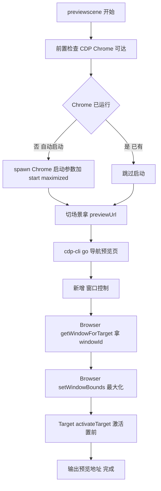

# cocoscli previewscene 窗口最大化与 focus 可行性分析与执行计划

> 需求：`cocoscli previewscene` 打开预览后，自动将浏览器窗口最大化并 focus（置前），让用户/Agent 第一时间看到预览画面。
> 本文只做分析与计划，不执行。

## 1. 背景与需求

当前 `previewscene` 流程：切场景 → 拿 previewUrl → cdp-cli `go` 在 CDP Chrome 导航预览 → `eval` 验证 `window.cc`。打开预览后窗口可能不是最大化、也可能不在前台（被编辑器/其它窗口遮挡），需要手动点一下任务栏。

期望：预览打开后，Chrome 窗口**最大化** + **置前聚焦**，无需人工干预。

## 2. 现状分析

### 2.1 previewscene 现有实现

`src/commands/preview-scene.ts` 关键链路：

1. 前置检查：CocosMCP 已装 / MCP HTTP 跑 / cdp-cli 可用 / CDP Chrome 可达
2. Chrome 不可达时自动 spawn（`--remote-debugging-port=9223` + `--user-data-dir` + `--no-first-run` + `--no-default-browser-check`），**没有 `--start-maximized`**
3. CocosMCP：`get_list` → `open` 切场景 → `server_information` 拿 previewUrl
4. cdp-cli：`tabs` 拿 pageId → `go pageId previewUrl` 导航 → 等 3 秒 → `eval pageId typeof(window.cc)` 验证

已经拿到 pageId，这是后续窗口控制的关键输入（`Target.activateTarget` 与 `Browser.getWindowForTarget` 都要 targetId/pageId）。

### 2.2 cdp-cli 能力边界

`deps/cdp-cli` 已封装的命令：tabs / new / go / close / console / snapshot / eval / screenshot / network / click / fill / key / launch。**没有窗口控制命令**（无 maximize / activate / setWindowBounds）。

但底层 `CDPContext`（`deps/cdp-cli/src/context.ts`）有通用能力：

| 方法 | 作用 | 是否可复用 |
|---|---|---|
| `sendCommand(ws, method, params)` | 发任意 CDP 命令并等响应 | 可，但需 cdp-cli 暴露 CLI 入口才能经 `runCdpCliSync` 调 |
| `getBrowserWebSocketUrl()` | 从 `/json/version` 拿 browser-level WS URL | 可，发 `Browser.*` 命令的前提 |

### 2.3 端口约定

- cdp-cli 默认端口 **9223**（`deps/cdp-cli/src/config.ts` 的 `getDefaultPort()`，无 `.cdp-cli.json` 时回退 9223）
- previewscene 启动 Chrome 也用 **9223**
- 两者一致，无需额外端口配置

## 3. 技术可行性

### 3.1 CDP 窗口控制命令（Chrome DevTools Protocol 标准，有头 Chrome 支持）

| CDP 命令 | 作用 | 需要的 WS 级别 |
|---|---|---|
| `Browser.getWindowForTarget({ targetId })` | 用 pageId 拿 windowId | browser-level |
| `Browser.setWindowBounds({ windowId, bounds: { windowState: 'maximized' } })` | 最大化窗口 | browser-level |
| `Browser.getWindowBounds({ windowId })` | 查窗口状态（含 windowState） | browser-level |
| `Target.activateTarget({ targetId })` | 激活目标 tab，Chrome 通常把窗口切前台 | browser-level |

browser-level WS URL 来源：`http://localhost:9223/json/version` 返回的 `webSocketDebuggerUrl`（形如 `ws://localhost:9223/devtools/browser/<guid>`）。

`Browser.WindowState` 枚举：`normal` / `minimized` / `maximized` / `fullscreen`。

### 3.2 方案对比

| 方案 | 最大化 | focus | 改动范围 | 覆盖"已有 Chrome"场景 | 可靠性 |
|---|---|---|---|---|---|
| A. 启动参数 `--start-maximized` | 启动即最大化 | 无 | previewscene spawn 加一个参数 | 否（仅自动启动 Chrome 时生效） | 高（但场景受限） |
| B. CDP setWindowBounds + activateTarget | 运行时最大化 | CDP 激活 tab | cocoscli 新增 utils + 集成 | 是 | 中高 |
| C. OS 层 focus（PowerShell AppActivate / osascript / wmctrl） | 需另配 | OS 级置前 | 跨平台分支多，依赖外部工具 | 是 | 高（但维护成本高） |
| D. 给 cdp-cli 加 window 命令 | 经 subprocess | 经 subprocess | 改 submodule + 同步指针 + 重新 build | 是 | 高（但流程重） |

**类比理解**：方案 A 像"出门前先把伞打开"（只在出门那一刻有效，已在路上的伞管不到）；方案 B 像"远程遥控伞的开关"（不管伞是谁打开的，都能遥控，但遥控信号偶尔被遮挡）；方案 C 像"直接伸手去撑伞"（最直接，但要人在每把伞旁边，跨城市就要不同的人）。生产推荐 A+B 组合（出门先开 + 远程兜底）。

### 3.3 可行性结论

- **最大化**：可行。方案 A（启动参数）零成本覆盖自动启动场景；方案 B（CDP setWindowBounds）覆盖所有场景。A+B 双保险。
- **focus**：可行。CDP `Target.activateTarget` 是 CDP 原生的窗口激活手段；配合 setWindowBounds(maximized)（最大化通常附带窗口激活）双管齐下。Windows 焦点抢占受 OS 限制（SetForegroundWindow 偶尔被拒），CDP activateTarget 内部同样走 SetForegroundWindow，故中高可靠；若实测不够再补方案 C 兜底。
- **推荐路径**：**不改 cdp-cli submodule**（避免发布流程复杂化），在 cocoscli 内新增 `utils/cdp-window.ts`，用 `ws`（已是根依赖）直连 browser-level WS 发命令。previewscene 已有 pageId，直接传入即可。

## 4. 推荐方案架构



新增模块 `utils/cdp-window.ts` 职责：

```
utils/cdp-window.ts
  ├─ resolveBrowserWsUrl(port)     从 /json/version 拿 browser WS URL
  ├─ getWindowForTarget(ws, pageId)  Browser.getWindowForTarget → windowId
  ├─ maximizeWindow(ws, windowId)    Browser.setWindowBounds(windowState=maximized)
  ├─ activateTarget(ws, pageId)      Target.activateTarget
  └─ focusAndMaximize(port, pageId) 组合入口（连 WS → maximize → activate → 关 WS）
```

previewscene 在第 5 步 `eval` 验证 `window.cc` 之后，调用 `focusAndMaximize(9223, pageId)`，不阻塞主流程（失败仅黄字警告）。

## 5. 执行计划

### P1 启动参数兜底（最小改动，立即可用）

- 文件：`src/commands/preview-scene.ts`
- 改动：自动启动 Chrome 的 spawn args 增加 `'--start-maximized'`
- 验证：手动关掉 CDP Chrome，跑 previewscene，确认新启的 Chrome 最大化
- 覆盖：仅"自动启动"分支

### P2 新增 CDP 窗口控制工具

- 新文件：`src/utils/cdp-window.ts`
- 依赖：`ws`（根 package.json 已有）
- 函数：
  - `resolveBrowserWsUrl(port: number): Promise<string>`：`fetch http://localhost:${port}/json/version` 取 `webSocketDebuggerUrl`
  - `sendBrowserCommand(ws, method, params): Promise<any>`：复用 cdp-cli 的 sendCommand 思路（自建，不依赖 cdp-cli 内部）
  - `focusAndMaximize(port: number, pageId: string): Promise<{maximized: boolean; activated: boolean}>`：
    1. 连 browser WS
    2. `Browser.getWindowForTarget({ targetId: pageId })` → windowId
    3. `Browser.setWindowBounds({ windowId, bounds: { windowState: 'maximized' } })`
    4. `Target.activateTarget({ targetId: pageId })`
    5. 关 WS，返回结果
- 错误处理：任一步失败不抛，返回标记位，调用方黄字提示

### P3 previewscene 集成

- 文件：`src/commands/preview-scene.ts`
- 改动：第 5 步 eval 之后插入
  ```ts
  console.log(chalk.gray('最大化并聚焦预览窗口...'));
  const r = await focusAndMaximize(9223, pageId);
  // r.maximized / r.activated 控制输出
  ```
- 端口来源：previewscene 已写死 9223（与 cdp-cli 默认一致），P2 函数签名收 port 参数便于后续配置化

### P4 测试与跨平台验证

- 单测：`src/__tests__/utils/cdp-window.test.ts`，mock WebSocket（参考 `deps/cdp-cli/tests/mocks/websocket.mock.ts` 思路），验证：
  - `resolveBrowserWsUrl` 解析 `/json/version`
  - `focusAndMaximize` 发出正确的 CDP 命令序列
  - windowId 缺失 / setWindowBounds 失败 / activate 失败各分支返回标记位不抛
- 实测清单（手动）：
  - [ ] 自动启动 Chrome：P1 启动参数生效 + P2 CDP 再最大化
  - [ ] 已有 Chrome 在后台：P2 activateTarget 能否拉前台
  - [ ] 已有 Chrome 最小化：P2 setWindowBounds(maximized) 能否恢复
  - [ ] Windows 焦点抢占：连续两次 previewscene 第二次是否被 OS 拒绝 focus

### P5（可选）OS 层 focus 兜底

仅当 P4 实测发现 CDP activateTarget 在 Windows 不可靠时启动：

- Windows：`powershell -Command "$ws = New-Object -ComObject Wscript.Shell; $ws.AppActivate('Chrome')"`
- macOS：`osascript -e 'tell application "Google Chrome" to activate'`
- Linux：`wmctrl -a "Chrome"` 或 `xdotool windowactivate`
- 封装进 `utils/cdp-window.ts` 的 `osFocusWindow()`，平台判断后分支调用，工具缺失时跳过

## 6. 风险与验证项

| 风险 | 影响 | 验证/缓解 |
|---|---|---|
| `Browser.setWindowBounds` 的 `windowState=maximized` 在不同 Chrome 版本行为不一致 | 最大化可能只改尺寸不真正 maximize | P4 实测多版本；不可靠时 fallback 用 `Browser.setWindowBounds` 设 `width/height` 为屏幕尺寸 |
| `Target.activateTarget` 在 Chrome 最小化/后台时无法真正 focus | 窗口不置前 | P4 实测；不够则启 P5 OS 层兜底 |
| Windows SetForegroundWindow 焦点抢占限制 | 连续操作第二次 focus 被拒 | P4 多次调用实测；可用 AppActivate（带 AttachThreadInput 等价）绕过 |
| browser WS 连接失败（Chrome 刚起 WS 未就绪） | 窗口控制整段失败 | 已有 checkCdp + 等 5 秒；P2 加重试或短延迟 |
| headless Chrome 不支持窗口命令 | 无效 | previewscene 用有头 Chrome，不涉及 |

## 7. 不采纳方案说明

- **方案 D（改 cdp-cli submodule 加 window 命令）**：技术上最干净（复用 CDPContext.sendCommand），但 cdp-cli 是 submodule，改它要同步指针、`npm run build:deps` 重新 build、走发布流程（CLAUDE.md 发布注意事项），成本远高于在 cocoscli 内直连 WS。若未来窗口控制命令需要被其它工具复用，再下沉到 cdp-cli。

## 8. 参考引用

- Chrome DevTools Protocol - Browser domain（getWindowForTarget / setWindowBounds / getWindowBounds）：
  https://chromedevtools.github.io/devtools-protocol/tot/Browser/
- Chrome DevTools Protocol - Target domain（activateTarget）：
  https://chromedevtools.github.io/devtools-protocol/tot/Target/
- CDP /json/version HTTP endpoint（browser WS URL 来源）：
  https://chromedevtools.github.io/devtools-protocol/#endpoints
- Chromium 命令行开关（--start-maximized 等）：
  https://peter.sh/experiments/chromium-command-line-switches/#--start-maximized
- Windows SetForegroundWindow 焦点抢占限制：
  https://learn.microsoft.com/en-us/windows/win32/api/winuser/nf-winuser-setforegroundwindow
- 项目内相关：
  - `src/commands/preview-scene.ts`（现有 previewscene 实现）
  - `deps/cdp-cli/src/context.ts`（CDPContext sendCommand / getBrowserWebSocketUrl 参考）
  - `deps/cdp-cli/src/config.ts`（默认端口 9223 约定）
